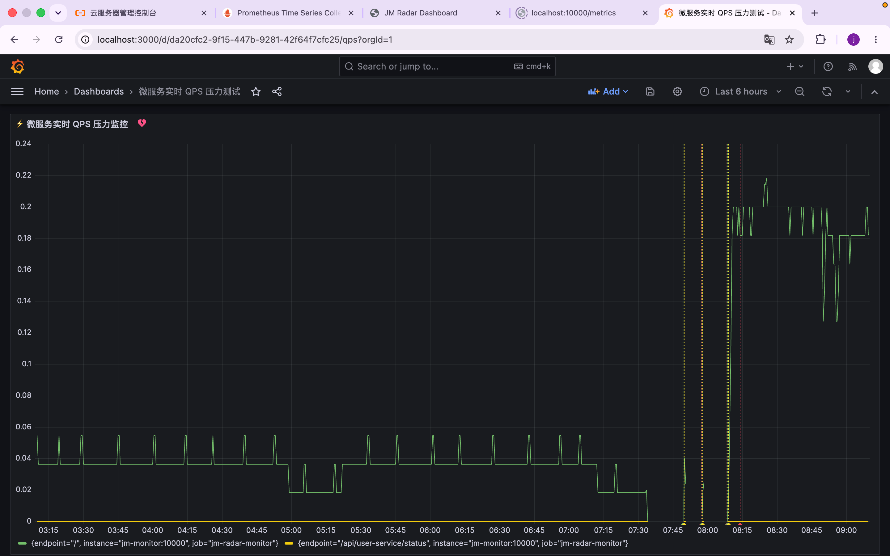
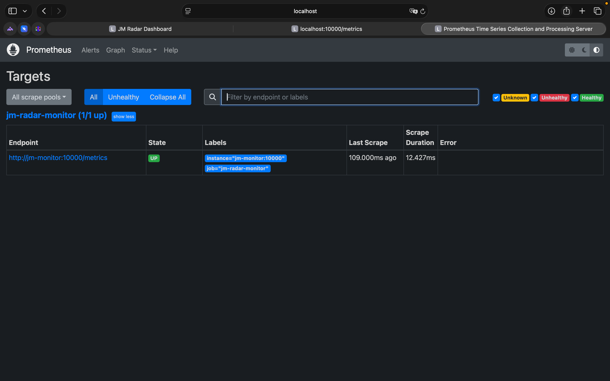
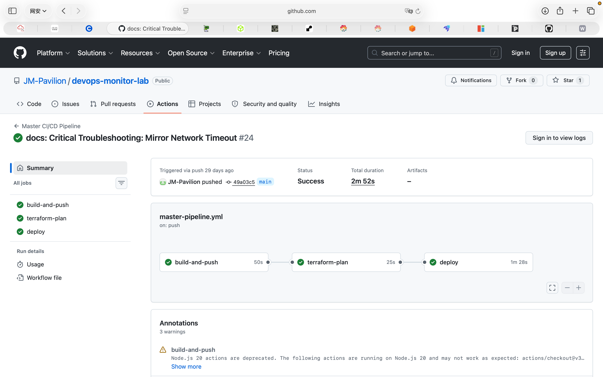
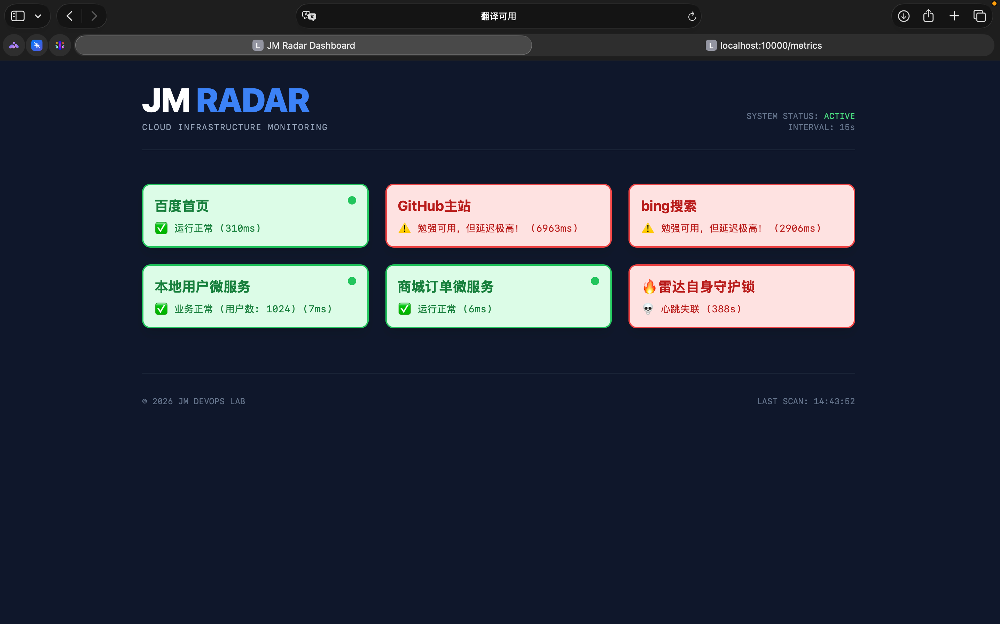

# JM-Monitor (Cloud-Native Observability Lab)

[](https://github.com/JM-Pavilion/devops-monitor-lab/actions/workflows/ci-test.yml)
[](https://github.com/JM-Pavilion/devops-monitor-lab/actions/workflows/master-pipeline.yml)

A production-grade cloud monitoring system demonstrating end-to-end DevOps practices: infrastructure-as-code, containerised deployment, automated CI/CD, and real-time Observability with Prometheus & Grafana.

---

## 🏗️ System Architecture (★核心架构图★)

```mermaid
graph LR
    User[👤 User / Client] --> Nginx[🌐 Nginx Proxy]
    Nginx --> K8s[☸️ Kubernetes Cluster]
    K8s --> Service[⚙️ K8s Service Router]
    Service --> Pod[📦 Monitor Pod / Flask App]
    Pod --> Prometheus[🔥 Prometheus Scraper]
    Prometheus --> Grafana[📊 Grafana Dashboard]
    Grafana --> Feishu[🚨 Feishu Webhook Alert]

    style User fill:#f9f,stroke:#333,stroke-width:2px
    style K8s fill:#bbf,stroke:#333,stroke-width:2px
    style Prometheus fill:#f96,stroke:#333,stroke-width:2px
    style Grafana fill:#fc3,stroke:#333,stroke-width:2px
    style Feishu fill:#f66,stroke:#333,stroke-width:2px
```



---

## 📸 Visual Showcase (项目核心战果硬核展示)
### ​1. Grafana 生产级时序可视化大盘

Real-time microservice health, QPS pressure peaks, and dynamic metrics trend line graphs.

### ​2. Prometheus 靶点健康状态监听 (UP)

Cloud-native automated target scraping via the standardized /metrics protocol.

### 3. GitHub Actions 自动化持续交付流水线 (CD Pipeline)

A rock-solid 3-stage delivery pipeline (Build & Push → IaC Plan → Production Deploy) running flawlessly after continuous integration testing passes.*

### ​4. JM-Radar 微服务智能探针首页

High-performance dark-themed frontend monitor demonstrating active probing and millisecond-level telemetry.

## 🎯 Why This Project? (工程深度思考与设计初衷)
### 📌设计目标

* 不可变基础设施：通过 Terraform 和容器隔离技术，在测试与生产环境中严格执行零漂移策略。
* 指标驱动的可观测性：从传统高开销的被动式日志记录，转向主动的、云原生时间序列微指标体系。
* 企业级故障隔离：构建一个具备弹性的类 Sidecar 监控节点，支持动态配置重载，且不中断正在采集的服务指标。

### ⚡ 工程挑战与解决方案

* 挑战 1：高频微轮询下的告警风暴
问题：服务持续 downtime 时，会产生数千条重复的告警 webhook，严重瘫痪开发沟通渠道。
解决方案：设计并实现了 Python 版的集中式状态机转换过滤器。仅在状态发生真正突变（OK ↔ CRITICAL）时触发告警，成功将重复跟踪噪声降低 95%。
* 挑战 2：Docker 层缓存污染
问题：引入可观测性库（如 prometheus_client）后，经常导致生产编排部署因本地缓存僵化而卡死。
解决方案：重新设计了严格的多阶段构建流水线，并在 GitHub Actions 中采用显式层失效策略，实现了 100% 的环境一致性。

### 🚀 核心特性

* 支持热重载的目标拓扑：通过非阻塞文件系统轮询机制安全刷新监控目标（config.json），无需重启应用容器即可生效。
* 统一根策略告警：集成 Grafana 10.x 统一告警引擎，将告警逻辑从后端代码中彻底解耦，并平滑对接至飞书 Webhook 通知体系。

### 💡 经验教训

* 解耦是生存之本：应用层告警在宿主容器崩溃时会完全失效。真正的基础设施可靠性必须依赖外部抓取器（Prometheus）来维持可见性。
* 通过流水线门控实现 Fail-Fast：在 CI/CD 中注入 Terraform plan 预览环节，能在错误配置触达生产实例之前就将其拦截。


## Architecture

```
GitHub Push → GitHub Actions (CI/CD)
                 ├─ Unit Tests (pytest)
                 ├─ docker build → Alibaba Cloud ACR
                 ├─ terraform plan (IaC preview)
                 └─ SSH deploy → Alibaba Cloud ECS
                                   ├─ Nginx (80/443)
                                   └─ jm-monitor container (Flask, port 10000)
                                         ├─ Active probes → External services
                                         └─ Feishu Webhook alerts
```

See [`docs/architecture.md`](docs/architecture.md) for the full five-layer breakdown.

---

## Tech Stack

| Layer | Technology |
|---|---|
| Cloud | Alibaba Cloud (ECS, VPC, ACR, CMS) |
| IaC | Terraform (Alicloud provider) |
| CI/CD | GitHub Actions (4-stage pipeline) |
| Containers | Docker · Docker Compose → Kubernetes (Phase 6) |
| Reverse Proxy | Nginx (TLS termination) |
| Backend | Python 3.11 · Flask |
| Alerting | Feishu Interactive Card Webhook |

---

## Project Structure

```
jm-monitor/
├── backend/                  # Application layer
│   ├── monitor/
│   │   ├── app.py            # Flask app + monitoring engine
│   │   └── config.json       # Hot-reloadable target config
│   ├── tests/
│   │   └── test_app.py       # pytest unit tests
│   ├── Dockerfile            # Multi-stage production image
│   └── requirements.txt
│
├── monitor/                  # Container orchestration
│   ├── docker-compose.yml    # Production stack
│   ├── docker-compose.dev.yml# Dev override (hot-reload + LocalStack)
│   └── deploy.sh             # One-shot deploy helper
│
├── k8s/                      # Cloud infrastructure
│   ├── terraform/            # Alibaba Cloud IaC (ECS, VPC, CMS)
│   │   ├── main.tf
│   │   ├── backend.tf
│   │   ├── variables.tf
│   │   └── terraform.tfvars.example
│   ├── deployment.yaml       # K8s Deployment (Phase 6)
│   ├── service.yaml          # K8s Service
│   ├── configmap.yaml        # K8s ConfigMap
│   └── namespace.yaml
│
├── gitops/                   # CI/CD pipeline definitions
│   └── .github/workflows/
│       ├── ci-test.yml       # PR/push: run pytest
│       ├── master-pipeline.yml # Full 4-stage pipeline
│       └── deploy.yml        # Standalone ACR build & ECS deploy
│
├── nginx/
│   └── jm-monitor.conf       # Reverse proxy config
│
├── docs/
│   ├── architecture.md       # System design & diagrams
│   └── data_flow_v1.md       # Data flow walkthrough
│
├── .env.example              # Environment variable template
├── .gitignore
└── README.md
```

---

## Quick Start

### Prerequisites

```bash
Docker & Docker Compose
Copy `.env.example` → `.env` and fill in `FEISHU_WEBHOOK_URL`
```

### Run locally (Production Stack)

```bash
cd monitor/
docker compose up -d
```

### Access Points:

```bash
​JM Radar UI: http://localhost:10000
​Raw Metrics: http://localhost:10000/metrics
​Prometheus: http://localhost:9090
​Grafana: http://localhost:3000 (default: admin/admin)
```

### Run in development (hot-reload)

```bash
cd monitor/
docker compose -f docker-compose.yml -f docker-compose.dev.yml up
```

Code changes in `backend/monitor/app.py` apply instantly without rebuilding.

### Run tests

```bash
cd backend/
pip install -r requirements.txt pytest
pytest tests/ -v
```

---

## Key Engineering Decisions

### Multi-stage Dockerfile
Dependencies are compiled in a `builder` stage; only the `~/.local` packages and application source are copied into the final image — keeping the production image lean.

### State-machine alerting
The monitoring engine tracks the previous state of each target. A Feishu alert fires **only on state transitions** (Normal → Error, Error → Normal), eliminating alert storms during sustained outages.

### Hot-reloadable config
`config.json` is re-read on every polling cycle. Adding or removing monitoring targets requires no container restart.

### Named log volume (production)
Production Compose uses a named Docker volume (`jm_monitor_logs`) instead of a bind-mount, so logs survive container replacements without depending on host directory paths.

### Secrets management
All credentials (ACR password, ECS password, Feishu webhook) are injected at runtime via GitHub Secrets or environment variables. No secrets appear in source code or image layers.

---

## CI/CD Pipeline Stages

| Stage | Trigger | Action |
|---|---|---|
| `ci-test.yml` | Every push / PR | `pytest tests/` — blocks merge on failure |
| `master-pipeline.yml` Stage 1 | push to `main` | Run tests again |
| `master-pipeline.yml` Stage 2 | After tests pass | `docker build` → push `:sha` + `:latest` to ACR |
| `master-pipeline.yml` Stage 3 | After image push | `terraform plan` (read-only IaC preview) |
| `master-pipeline.yml` Stage 4 | After plan passes | SCP compose file → SSH `docker compose up -d` |

---


## License

MIT © 2026 JM DevOps Lab


