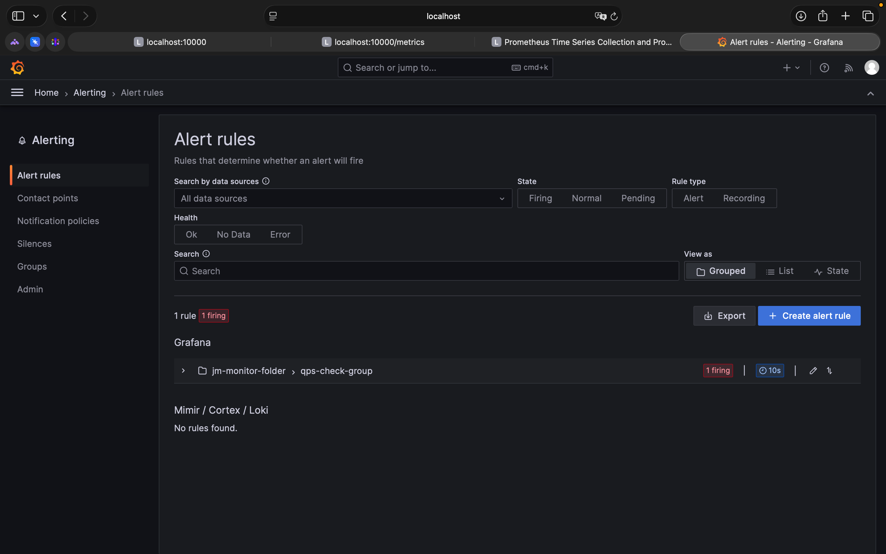

# JM-Monitor — System Architecture

## Five-Layer Architecture

```
┌──────────────────────────────────────────────────────┐
│  Layer 5 · GitOps / CI/CD                           │
│  GitHub Actions: test → build → plan → deploy       │
└──────────────────────────┬───────────────────────────┘
                           │
┌──────────────────────────▼───────────────────────────┐
│  Layer 4 · IaC (Terraform)                          │
│  Alibaba Cloud: VPC · ECS · ACR · CMS Alarm         │
└──────────────────────────┬───────────────────────────┘
                           │
┌──────────────────────────▼───────────────────────────┐
│  Layer 3 · Container Orchestration                  │
│  Docker Compose (current) → Kubernetes (Phase 6)    │
└──────────────────────────┬───────────────────────────┘
                           │
┌──────────────────────────▼───────────────────────────┐
│  Layer 2 · Reverse Proxy                            │
│  Nginx: TLS termination · Port 80/443 → 10000       │
└──────────────────────────┬───────────────────────────┘
                           │
┌──────────────────────────▼───────────────────────────┐
│  Layer 1 · Application (Flask / Python 3.11)        │
│  Active HTTP probes + Passive heartbeat + Feishu    │
└──────────────────────────────────────────────────────┘
```

## CI/CD Pipeline Flow

```
git push main
     │
     ▼
[Stage 1] Unit Tests (pytest)
     │ pass
     ▼
[Stage 2] docker build → push :sha + :latest → ACR
     │ success
     ▼
[Stage 3] terraform plan (read-only IaC preview)
     │ no errors
     ▼
[Stage 4] scp docker-compose.yml → ECS
          ssh: docker compose pull && up -d
```

## Monitoring Logic — State Machine

```
NORMAL ──── probe fails ───► ERROR/DOWN ──── recovered ───► NORMAL
  │                              │
  │                         send 🚨 Feishu alert
  │                              │
  └──── still normal ────────────┘ (no alert, no noise)
```

## Directory Map

| Path | Purpose |
|------|---------|
| `backend/` | Python Flask app, Dockerfile, tests |
| `monitor/` | Docker Compose orchestration, deploy script |
| `k8s/` | Kubernetes manifests + Terraform IaC |
| `gitops/` | GitHub Actions CI/CD workflows |
| `nginx/` | Reverse proxy config |
| `docs/` | Architecture & data flow documentation |

## 📊 系统数据流向与视觉佐证

关于系统运行状态与组件生命周期，可对照以下生产环境真实截图：

* **Grafana压力图：**
  
* **故障状态机转移：**
  
* **飞书告警卡片交互：**
  

